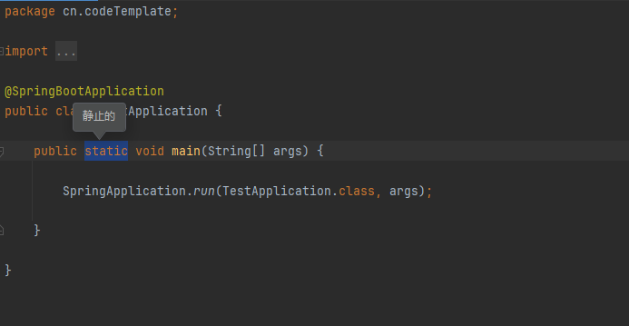
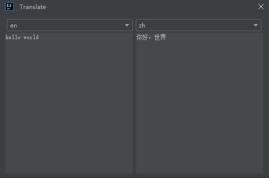

# TranslateHelper 插件

**TranslateHelper** 是一个用于 IntelliJ IDEA 的翻译插件，旨在提高开发者在编写代码或文档时的翻译效率。插件支持两种便捷的操作方式。

## 使用方法

1. **选中文本翻译**：
    - 在代码或文档中选中需要翻译的内容。
    - 右键单击选中的文本并选择 `Translate` 选项。
    - 翻译结果会直接显示在您的 IDE 中。

2. **手动输入翻译**：
    - 右键点击编辑器的任意位置，在没有选中文本的情况下选择 `Translate`。
    - 插件将弹出一个输入框，用户可以在其中输入待翻译的文本。
    - 按下回车键，翻译结果将立即显示。

## 设置

在使用 **TranslateHelper** 插件之前，您需要在设置中配置 `appId` 和 `secretKey`。请按照以下步骤进行设置：

1. 打开 IntelliJ IDEA，进入 `File > Settings > TranslateHelper`。
2. 在 `TranslateHelper` 设置页面中，输入您的 `appId` 和 `secretKey`。
3. 点击 `Save` 保存设置。

### 如何申请 `appId` 和 `secretKey`

您需要在 [百度翻译开放平台](https://fanyi-api.baidu.com/) 申请 `appId` 和 `secretKey`。个人用户可以选择免费升级至高级版，每月提供的免费字符完全够用。以下是百度翻译的定价和版本说明：

- **标准版**：
    - 每月前 5 万字符免费，超出部分按 49 元/百万字符计费。
    - 单次最长请求 1000 字符。
    - 支持 28 个常见语种。

- **高级版**：
    - 每月前 100 万字符免费，超出部分按 49 元/百万字符计费。
    - 单次最长请求 6000 字符。
    - 支持 28 个常见语种。

## 安装说明

1. 打开 IntelliJ IDEA，进入 `File > Settings > Plugins`。
2. 在插件市场中搜索 `TranslateHelper`。
3. 点击 `Install` 安装插件。
4. 安装完成后，重启 IDE 即可开始使用。

## 常见问题

- **为什么翻译结果没有显示？**
    - 请确保在翻译时您的网络连接正常。
    - 如果是选中文本翻译，确保您选中的内容没有误触其他快捷键。

## 反馈与支持

如果您在使用过程中遇到问题，或有任何建议，请在 [GitHub Issues](https://github.com/your-repo/issues) 上提交反馈。

感谢您使用 **TranslateHelper** 插件！希望它能为您的开发工作提供帮助。